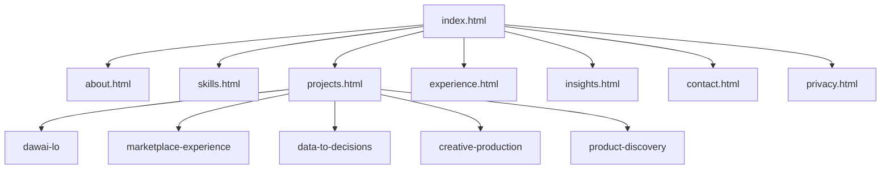

# Site map, wireframes and prior-site audit

## Sitemap (URL structure)

| Path | Purpose |
|------|---------|
| `/index.html` | Home: positioning, portrait, selected work, testimonials CTA |
| `/about.html` | First-person story, values, background |
| `/skills.html` | Grouped skills (technical / product / creative), no fake percentages |
| `/projects.html` | Filterable gallery (data from `data/projects.json`) |
| `/projects/dawai-lo.html` | Case study |
| `/projects/marketplace-experience.html` | Case study |
| `/projects/data-to-decisions.html` | Case study (includes `#forecasting`) |
| `/projects/creative-production.html` | Case study |
| `/projects/product-discovery.html` | Case study |
| `/experience.html` | Interactive résumé (`<details>`), education, CV download |
| `/insights.html` | Optional blog-style articles (plain HTML) |
| `/contact.html` | Form + direct email / social |
| `/privacy.html` | Privacy policy |
| `/sitemap.xml` | SEO sitemap |
| `/robots.txt` | Crawler rules |



## Wireframes (structural)

### Global chrome (all pages)

```
┌─────────────────────────────────────────────────────────────┐
│ [Logo Adeen Amer]     Nav… Nav…     [Theme] [Hamburger]       │  ← sticky header
├─────────────────────────────────────────────────────────────┤
│                                                               │
│   MAIN (max-width container, padding)                        │
│                                                               │
├─────────────────────────────────────────────────────────────┤
│ Footer: blurb | mini-nav | social SVGs | © Privacy           │
└─────────────────────────────────────────────────────────────┘
```

Mobile: nav collapses to drawer (focus trap via Escape + backdrop click).

### Home (`index.html`)

```
┌──────────────────────┬──────────────────────┐
│ H1 + lede + CTAs     │   Portrait image      │  ← stacks on narrow
│ stat | stat | stat   │                       │
└──────────────────────┴──────────────────────┘
[ Selected work: 3 cards ]
[ Testimonials: 3 quotes ]
[ CTA band: contact button ]
```

### Projects (`projects.html`)

```
[ Filter: All | Product | Data | Creative ]
┌───────┐ ┌───────┐ ┌───────┐
│ thumb │ │ thumb │ │ thumb │   ← cards from JSON
│ tags  │ │ tags  │ │ tags  │
│ title │ │ title │ │ title │
└───────┘ └───────┘ └───────┘
```

### Experience (`experience.html`)

```
[ Download CV ] [ LinkedIn ]
─────────────────────────────
▾ Role — Company        (details open)
  dates
  • bullets
▸ Role — Company        (collapsed)
...
```

## High-fidelity mockups (light and dark)

The implemented stylesheet (`assets/css/site.css`) **is** the high-fidelity reference.

- **Light mode:** warm stone surfaces (`#fafaf9`, `#ffffff`), near-black text (`#0c0a09`), teal accent (`#0d9488`).
- **Dark mode:** deep stone background (`#0c0a09`), elevated cards (`#1c1917`), brighter teal accent (`#2dd4bf`) for WCAG contrast on borders and links.
- **Typography:** `Fraunces` (display / humanist serif feel) + `Source Sans 3` (neutral body). Fluid sizes via `clamp()` on `:root` tokens.
- **Shape:** rounded cards (`12–20px`), soft shadows, generous vertical rhythm (`--space-*`).

Exporting PNG/Figma files was not required for code delivery; open any HTML file in a browser and toggle the sun/moon control to review both themes.

## Prior site — audit summary

Issues addressed in this redesign:

| Issue | Mitigation |
|-------|------------|
| Single-page hash nav; subpages had broken `#hero` links | Multi-page routes with real URLs |
| GitHub icon linked to own Pages URL | Corrected to `https://github.com/adeen-amer` |
| Footer placeholder / template noise | Replaced with concise copy and privacy link |
| Portfolio tiles all pointed to one generic detail page | Distinct case study URLs per project (legacy `portfolio-details.html` removed) |
| Empty / generic `alt` on images | Descriptive alt text on key visuals |
| Inconsistent contact phone between sections | Consolidated on contact page with email-first |
| Testimonials commented / lorem | Section removed until permissioned quotes exist |
| Services cards linked to `#` | Removed; capabilities live in Skills + case studies |
| No privacy policy | `privacy.html` |
| No `robots.txt` / `sitemap.xml` | Added at site root |
| No dark mode | `data-theme` + toggle + `prefers-color-scheme` |
| Motion-heavy template defaults | `prefers-reduced-motion` respected in CSS and JS |

Optional future content: named testimonials, certificate images, analytics snippet, additional insight posts. PDF résumé and static insight posts are live.
